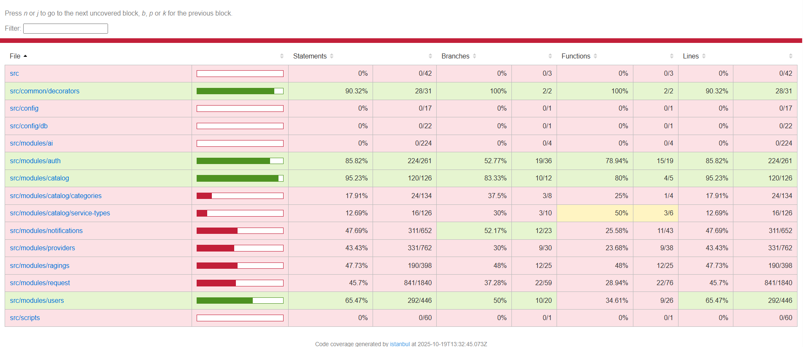

Reporte de Covertura. Acceso:

http://127.0.0.1:7777/lcov-report/index.html

reporte de cobertura. sirve como “tablero de control” del testing:

¿Qué mide?

Statements / Lines: porcentaje de líneas ejecutadas por los tests.

Functions: funciones que se ejecutaron.

Branches: caminos de decisión (if/else, ternarios, switch, excepciones, etc.).

Los colores ayudan:

🟩 bien cubierto, 🟨 medio, 🟥 bajo.
Podés hacer clic en cada archivo y te marca en rojo las líneas no ejecutadas para saber exactamente qué falta probar.

¿Para qué usarlo en tu proyecto?

Priorizar dónde testear
En tu captura, lo que más tracciona negocio y tiene baja cobertura es:

src/modules/request (~45%)

src/modules/notifications (~48%)

src/modules/providers (~43%)

src/modules/ragings (~48%)

Enfocando ahí subís rápido el % global.

Evitar regresiones
Ya tenés umbrales en jest-e2e.config.cjs:

coverageThreshold: { global: { lines: 60, statements: 60, branches: 43, functions: 60 } }

Si alguien sube un PR que baja de eso, el job de test falla. Es una red de seguridad.

Mejorar calidad, no solo cantidad
Cobertura alta ≠ buenos tests. Pero una cobertura baja suele esconder lógicas sin probar. Apuntá sobre todo a Branches (casos de error, autorizaciones, validaciones, reglas de negocio).

Ciclo de trabajo

Escribís/ajustás tests → npm run test:e2e

Abrís el reporte → npm run coverage:open

Hacés clic en los archivos rojos, agregás tests para esas líneas/casos.

Integrarlo al CI/CD (opcional)

Ejecutar npm run test:e2e en el pipeline.

Publicar el HTML o subir coverage/lcov.info a un servicio (p.ej. Codecov/Coveralls).

Mantener/ajustar coverageThreshold y, si querés, umbrales por archivo:

coverageThreshold: {
  global: { lines: 60, statements: 60, branches: 43, functions: 60 },
  './src/modules/request/**': { lines: 70, statements: 70, branches: 50, functions: 70 },
}

Consejos rápidos para subir cobertura

Agregá unit tests de Services para cubrir “ramas” (errores, permisos, estados inválidos).

Dejá los e2e para flujos felices y unos cuantos bordes clave (401/403/404/409).

Donde una rama es “improbable” (p. ej. guardas de Nest que ya probaste en otro lado), podés marcar líneas sin interés con:

/* istanbul ignore next */

(usalo con moderación).

En resumen: sí, esto es tu control de testing. Úsalo para decidir dónde escribir el próximo test y para hacer que el pipeline “proteja” la calidad. Si querés, te marco 2–3 casos concretos por módulo para escribir ya mismo y subir el Branch coverage.

---------------------------------------------------------------------------------------------------
Comando de Ejecucion:

PS C:\Users\vszni\repositorios\app_servicios\Api_Servicios_Backend_Next_JS> npm i -D http-server

added 19 packages, and audited 987 packages in 4s

164 packages are looking for funding
  run `npm fund` for details

13 moderate severity vulnerabilities

To address all issues (including breaking changes), run:
  npm audit fix --force

Run `npm audit` for details.
PS C:\Users\vszni\repositorios\app_servicios\Api_Servicios_Backend_Next_JS> npm run coverage:open

> servicios-app-backend@0.0.1 coverage:open
> npx http-server coverage -p 7777

Starting up http-server, serving coverage

http-server version: 14.1.1

http-server settings:
CORS: disabled
Cache: 3600 seconds
Connection Timeout: 120 seconds
Directory Listings: visible
AutoIndex: visible
Serve GZIP Files: false
Serve Brotli Files: false
Default File Extension: none

Available on:
  http://192.168.1.69:7777
  http://127.0.0.1:7777
  http://172.20.128.1:7777
Hit CTRL-C to stop the server

[2025-10-19T13:56:15.901Z]  "GET /lcov-report/index.html" "Mozilla/5.0 (Windows NT 10.0; Win64; x64) AppleWebKit/537.36 (KHTML, like Gecko) Chrome/140.0.0.0 Safari/537.36"
(node:17288) [DEP0066] DeprecationWarning: OutgoingMessage.prototype._headers is deprecated
(Use `node --trace-deprecation ...` to show where the warning was created)
[2025-10-19T13:56:15.966Z]  "GET /lcov-report/prettify.css" "Mozilla/5.0 (Windows NT 10.0; Win64; x64) AppleWebKit/537.36 (KHTML, like Gecko) Chrome/140.0.0.0 Safari/537.36"
[2025-10-19T13:56:15.967Z]  "GET /lcov-report/base.css" "Mozilla/5.0 (Windows NT 10.0; Win64; x64) AppleWebKit/537.36 (KHTML, like Gecko) Chrome/140.0.0.0 Safari/537.36"
[2025-10-19T13:56:15.971Z]  "GET /lcov-report/prettify.js" "Mozilla/5.0 (Windows NT 10.0; Win64; x64) AppleWebKit/537.36 (KHTML, like Gecko) Chrome/140.0.0.0 Safari/537.36"
[2025-10-19T13:56:15.972Z]  "GET /lcov-report/sorter.js" "Mozilla/5.0 (Windows NT 10.0; Win64; x64) AppleWebKit/537.36 (KHTML, like Gecko) Chrome/140.0.0.0 Safari/537.36"
[2025-10-19T13:56:15.973Z]  "GET /lcov-report/block-navigation.js" "Mozilla/5.0 (Windows NT 10.0; Win64; x64) AppleWebKit/537.36 (KHTML, like Gecko) Chrome/140.0.0.0 Safari/537.36"
[2025-10-19T13:56:16.036Z]  "GET /lcov-report/sort-arrow-sprite.png" "Mozilla/5.0 (Windows NT 10.0; Win64; x64) AppleWebKit/537.36 (KHTML, like Gecko) Chrome/140.0.0.0 Safari/537.36"
[2025-10-19T13:56:16.049Z]  "GET /lcov-report/favicon.png" "Mozilla/5.0 (Windows NT 10.0; Win64; x64) AppleWebKit/537.36 (KHTML, like Gecko) Chrome/140.0.0.0 Safari/537.36"